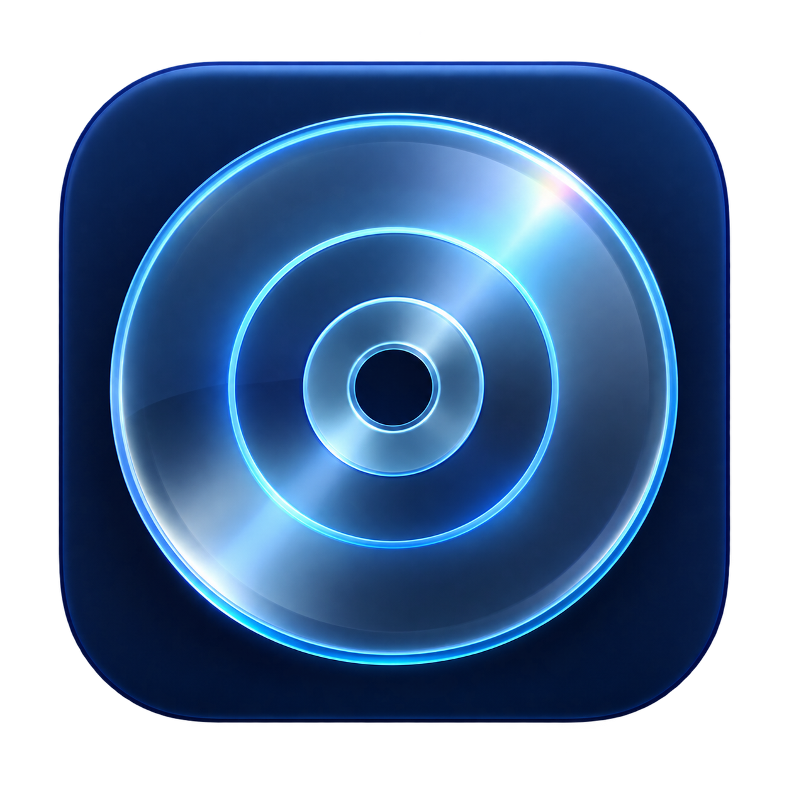
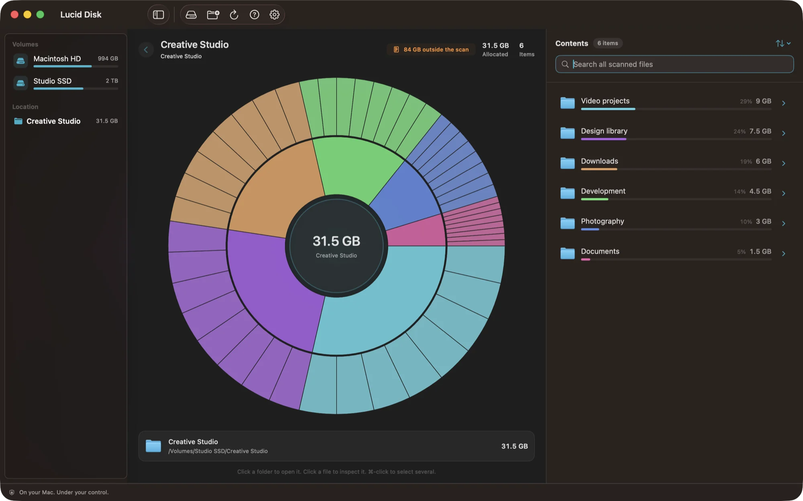
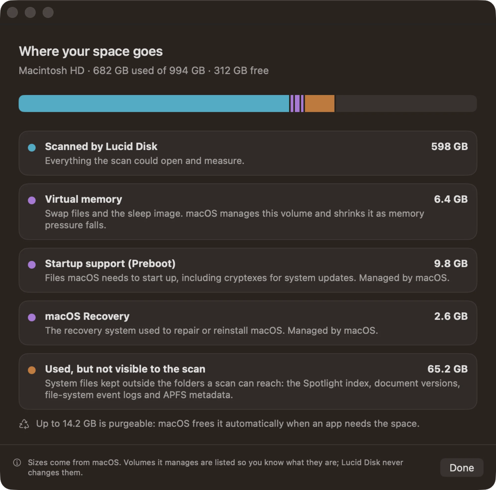
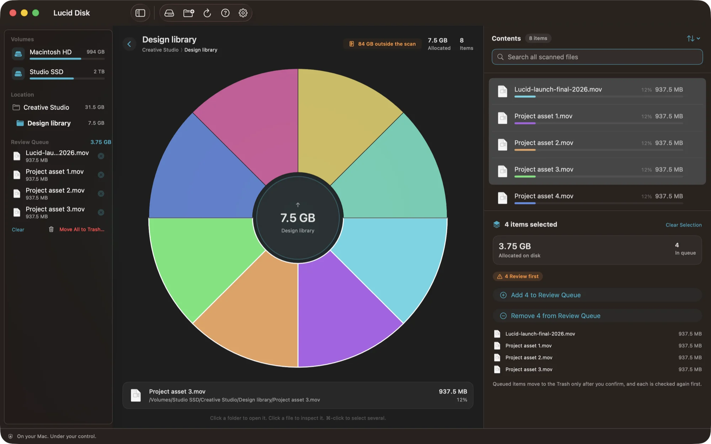
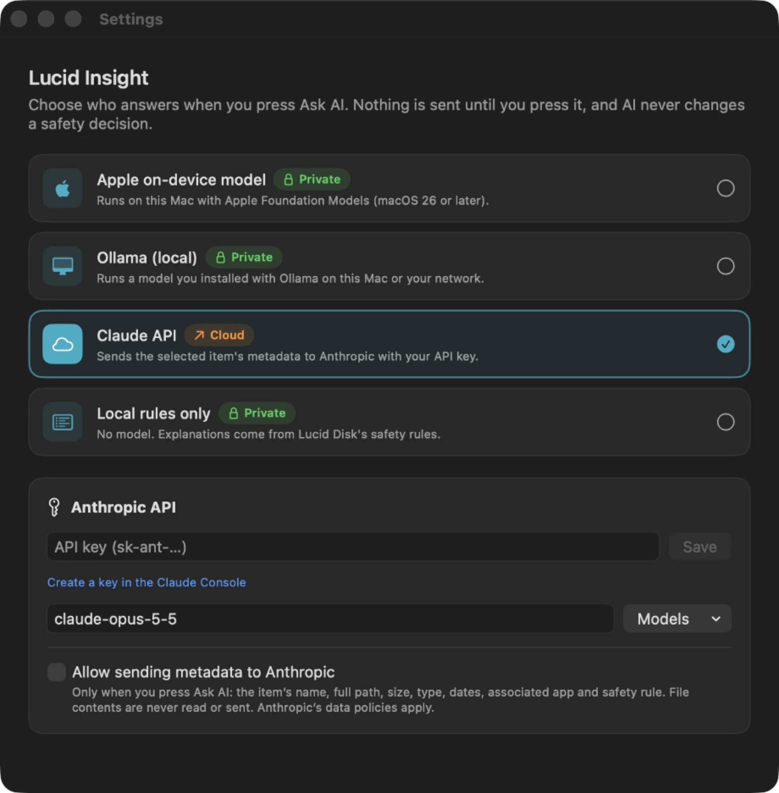

<p align="center">
  
</p>

<h1 align="center">Lucid Disk</h1>

<p align="center"><strong>See your disk. Keep your judgment.</strong></p>

<p align="center">
  <a href="https://lucid-disk.vercel.app">Website</a> ·
  <a href="https://github.com/serkan-uslu/lucid-disk/releases/latest/download/LucidDisk.dmg">Download for macOS</a> ·
  <a href="https://github.com/serkan-uslu/lucid-disk/releases/latest">Release notes</a> ·
  <a href="website/public/media/lucid-disk-promo.mp4">30-second tour</a>
</p>

<p align="center">
  <a href="https://github.com/serkan-uslu/lucid-disk/actions/workflows/ci.yml"></a>
  
  
</p>

Lucid Disk is a free, open-source disk space analyzer for macOS. It maps storage as an interactive sunburst, explains what "System Data" really is, lets you ask AI what an unfamiliar folder is, and moves only the items you review to the macOS Trash.

<p align="center">
  <a href="website/public/media/lucid-disk-promo.mp4">
    
  </a>
  <br><sub>30-second tour — click for the full-quality video.</sub>
</p>

<table>
  <tr>
    <td width="50%"><br><b>Map</b> — every byte, at a glance.</td>
    <td width="50%"><br><b>Space breakdown</b> — what “System Data” really is.</td>
  </tr>
  <tr>
    <td><br><b>Review</b> — select several, confirm once, Trash only.</td>
    <td><br><b>Ask AI</b> — Apple on-device, Ollama or Claude.</td>
  </tr>
</table>

## Highlights

- Scans folders and mounted volumes with cancellable, stale-result-safe tasks.
- Reports logical and allocated sizes, hard-link deduplication, and incomplete or estimated measurements.
- Provides searchable and sortable file views, Quick Look, keyboard navigation, and VoiceOver labels.
- Builds a review queue before any cleanup and blocks protected system locations. Select several items with ⌘-click (list or chart) to queue them together, then **Move All to Trash** with one confirmation; every item is re-checked just before it moves.
- Explains "System Data": after scanning a whole disk, **Space breakdown** shows what the scan measured, other APFS volumes (Preboot, Recovery, VM, Update), what is used but not visible to a scan, purgeable space, local Time Machine snapshots, and unreadable folders.
- Saves the last scan of each location on this Mac so it reopens instantly; saved scans can be browsed and queued, and a fresh scan is required before anything moves to the Trash.
- Produces Lucid Insight explanations only when you press **Ask AI**; ordinary selection never invokes a model. In **Settings → AI** choose Apple's on-device model (default), a local [Ollama](https://ollama.com) model, the Claude API with your own key, or rules only. The model only suggests a probable purpose; safety decisions stay deterministic.
- Includes an optional, read-only MCP server with five tools; **Settings → MCP** lists them and generates setup commands for Claude Code, Claude Desktop, and Codex.

Lucid Disk does not perform automatic cleanup or permanent deletion. Administrator scanning, snapshot cleanup, direct cloud connectors, and duplicate detection are not part of the first release. See [ROADMAP.md](ROADMAP.md).

## Requirements

- macOS 14 or later
- Xcode Command Line Tools with Swift 5.9 or later
- [`uv`](https://docs.astral.sh/uv/) only for the optional MCP server and its tests

## Build and test

```bash
swift test
swift build -c release
./build_app.sh
./build_dmg.sh
```

The scripts create a universal `arm64` + `x86_64` app and `build/LucidDisk.dmg` with a SHA-256 checksum. Local builds are ad-hoc signed. Signed, notarized releases — from GitHub Actions or from a Mac with a Developer ID certificate — are described in [docs/releasing.md](docs/releasing.md).

Scanning protected locations may require granting the built app Full Disk Access in System Settings.

The repeatable synthetic scanner benchmark and its reporting rules are documented in [BENCHMARK.md](BENCHMARK.md). The project makes no unmeasured speed claim.

See [QA.md](QA.md) for verified workflows and the remaining manual/release gates.

For the interactive desktop regression check, run `Tools/review_ui.sh -AppleLanguages '(en)'` on a Mac with a logged-in desktop. It exercises native row selection, folder double-click, chart drill-down/back, typed search, Return navigation, sidebar resizing, all help topics, Quick Look with Space/Escape, and a 10,000-entry directory. It also scans a disposable, uniquely named fixture under your home directory and drives queue/confirmation through the view model, moves only that generated file to macOS Trash, then restores it and removes the fixture. It never requests AI or removes existing user files. Review PNGs are written to `build/ui-review/`; Screen Recording permission is required for captures. Use `-AppleLanguages '(tr)'` to repeat in Turkish.

In the browser, a single click selects a row, double-click or Return opens a folder, and Space previews a selected file. Clicking a folder in the chart opens it immediately; clicking the center goes up. Search covers the entire scanned tree and runs in the background. **Ask AI** is the only action that requests a Lucid Insight explanation.

## In-app help

Open **Help → How to Use** or the toolbar’s question mark for the four-step guide, keyboard shortcuts, size-estimate explanations, Full Disk Access guidance, and privacy/safety details. **Lucid Disk → About Lucid Disk** shows the installed version, credits, and bundled Apache license. Help is a separate, non-modal window, so a scan continues while you read.

Use **⌘O** to choose a folder, **⌘R** to scan again, **⌘F** to focus search, **⌘←** to go up, and **⌘,** for Settings. A cancelled or failed rescan retains the last completed snapshot. A successful Trash operation reports its outcome and provides **Show in Trash**; reclaimable space is not guaranteed, and Lucid Disk never empties Trash.

## AI providers

| Provider | Setup | Leaves the Mac |
|---|---|---|
| Apple on-device | macOS 26+ with Apple Intelligence | Nothing |
| Ollama | Install Ollama, `ollama pull llama3.2`, pick the model in Settings | Nothing (unless the server URL is another machine) |
| Claude API | Paste an API key from the Claude Console (stored in Keychain), allow metadata sharing | Selected item's metadata, never contents |
| Rules only | — | Nothing |

The default Claude model is `claude-opus-5-5` at low effort; any model ID can be entered. Provider failures fall back to the rule-based explanation. See [PRIVACY.md](PRIVACY.md).

## Optional MCP server

| Tool | Purpose |
|---|---|
| `summarize_known_locations` | Sizes of common space hogs (Xcode DerivedData, caches, logs, Downloads, Trash, npm/Gradle caches) with risk |
| `inventory_directory` | Ranks a folder's direct children by allocated size |
| `find_large_files` | Largest files below a folder, one volume, hard links counted once |
| `assess_paths` | Size, accuracy, warnings, and risk for up to 50 paths |
| `create_cleanup_plan` | Groups paths by risk with blockers and review questions |

```bash
uv sync --project mcp
uv run --project mcp --with pytest pytest mcp/tests
```

The server never deletes or moves files. Its client may send paths and derived metadata to the model or service configured by that client, so enable it only when that disclosure is acceptable. See [mcp/README.md](mcp/README.md) and [PRIVACY.md](PRIVACY.md).

## Editions and architecture

This repository is the open-source Community edition. The app lives in the `LucidDiskCore` library; `Sources/LucidDisk` is a thin `@main` app on top of it. Other editions, such as a planned paid Pro app, depend on the library and add features through documented extension points — see [EDITIONS.md](EDITIONS.md) for the architecture and the promises the Community edition keeps.

## Repository layout

| Path | What it is |
|---|---|
| `Sources/LucidDiskCore`, `Sources/LucidDisk` | The macOS app (Swift, SwiftUI, AppKit) |
| `mcp/` | The optional read-only MCP server (Python) |
| `website/` | The landing page (Next.js); `npm install && npm run dev` |
| `video/` | The 30-second promo video (Remotion); `npm install && npm run render` |
| `Tools/` | Icon export and the desktop UI review harness (`LUCID_MARKETING=1` renders store screenshots) |

## Documentation

- [Architecture](docs/architecture.md) — modules, data flow, extension points
- [Development](docs/development.md) — setup, tests, UI review, localization, conventions
- [Safety model](docs/safety.md) — the invariants every change must keep
- [Releasing](docs/releasing.md) — signing, notarization and GitHub Releases

## Project policies

- [Editions](EDITIONS.md)
- [Privacy](PRIVACY.md)
- [Security](SECURITY.md)
- [Contributing](CONTRIBUTING.md)
- [Apache License 2.0](LICENSE)
