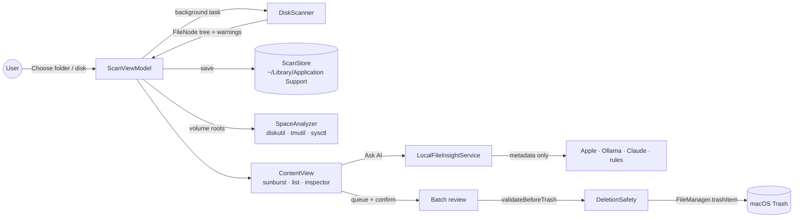
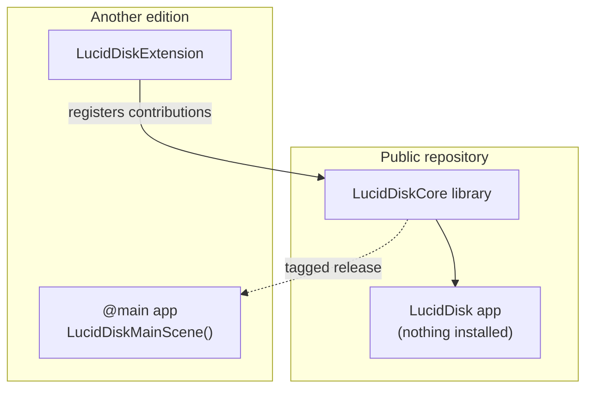

# Architecture

Lucid Disk is a native macOS app written in Swift (SwiftUI with AppKit where performance or native behavior matters). This page explains how the pieces fit together. For the rules every change must keep, read [safety.md](safety.md).

## Repository map

```text
Sources/
  LucidDiskCore/            the whole app, as a library
    App/                    LucidDiskMainScene: window, menus, Settings
    Scanning/               DiskScanner, ScanViewModel, batch review
    Safety/                 DeletionSafety: risk rules and pre-Trash checks
    Persistence/            ScanArchive (binary format), ScanStore (saved scans)
    Space/                  SpaceBreakdown: the "System Data" explainer
    Insight/                Lucid Insight: AI providers and the rule-based fallback
    Sunburst/               chart layout (Wedge) and drawing (SunburstView)
    Views/                  ContentView, inspector, settings, help, theme
    Extensions/             extension points for other editions
    Resources/              Localizable.xcstrings (English and Turkish)
  LucidDisk/                the Community @main app (a few lines)
Tests/                      XCTest suite + shared safety fixture
mcp/                        read-only MCP server (Python)
website/                    landing page (Next.js)
video/                      promo video and store art (Remotion)
Tools/                      icon export, desktop UI review harness
scripts/                    release verification and evidence
```

## Data flow



### Scanning

`DiskScanner` walks a directory tree with one `lstat` per entry, building a `FileNode` tree. It:

- counts hard-linked files once (by device and inode),
- stays on the root's volume and skips `/System/Volumes`, `/Volumes` and other system mount points, so firmlinked data is not counted twice,
- marks unreadable folders and cut-off scans as incomplete instead of hiding them,
- checks for cancellation between entries.

`ScanViewModel` (main actor) owns the published state: the tree, focus, selection (`selectedNode` plus `selectedNodes`), the review queue, warnings, saved scans and the space breakdown. Every scan gets a `scanID`; late results from a cancelled scan are ignored, and a cancelled or failed rescan keeps the previous result.

### Saved scans

`ScanArchive` encodes a tree as a compact, LZFSE-compressed preorder stream: names, flags, sizes, dates and identity per node, with paths rebuilt on load. `ScanStore` writes one archive plus a small JSON summary per scan and keeps `retentionPerRoot` scans per location (one in the Community edition). A saved scan opens as a snapshot: it can be browsed and queued, but nothing can be moved to the Trash until a fresh scan.

### Space breakdown

After a volume-root scan, `SpaceAnalyzer` compares the scanned total with what macOS reports. It reads APFS containers and volume roles from `diskutil apfs list -plist`, local snapshots from `tmutil`, swap from `sysctl vm.swapusage` and purgeable space from URL resource values. The result lists other volumes (Preboot, Recovery, VM, Update), used space a scan cannot see, and space counted twice by the scan; its parts always add up to the used space. System tools run by absolute path, with a timeout, behind the `SpaceProbe` protocol so tests use fixtures.

### Lucid Insight

Pressing **Ask AI** builds a prompt from the selected item's metadata (never file contents), with names and paths escaped as data. The provider chosen in Settings answers only the "probable purpose" line; risk, summary and recommendation always come from `DeletionSafety`. Providers: Apple Foundation Models, Ollama (local, cloud-hosted models hidden), the Claude API (key in Keychain, explicit consent), or rules only. Any failure falls back to the rule-based explanation, never to another provider.

### Cleanup

Cleanup is always: select → add to the review queue → confirm → `DeletionSafety.validateBeforeTrash` → `FileManager.trashItem`. Batch moves drop items inside another queued folder, exclude protected items, re-validate each item right before its own move, and report what was skipped. After any move the old tree is discarded and the location is rescanned.

## Editions and extension points

The app is a library so another edition can build on it. `LucidDiskExtensions` accepts an edition name and contributions for the sidebar, the inspector and Settings. Extensions receive a `LucidDiskContext` that can read the tree and selection and add items to the review queue, but cannot move anything to the Trash or construct a safety verdict. `ScanStore` is public so an edition can keep a scan history. See [EDITIONS.md](../EDITIONS.md).



## MCP server

`mcp/` is a separate Python package exposing five read-only tools over stdio. Its risk rules mirror `DeletionSafety.swift`; both test suites read `Tests/Fixtures/deletion-safety.json`, so the two implementations cannot drift apart silently. See [mcp/README.md](../mcp/README.md).

## Key decisions

| Decision | Why |
|---|---|
| Trash only, never delete | Every action stays reversible from Finder. |
| Deterministic safety over AI | Models can be wrong or manipulated; rules are testable. |
| Identity re-check before Trash | A file replaced after the scan must not be moved. |
| Allocated size in the chart | It reflects disk usage; logical size is shown alongside. |
| Binary archive for saved scans | Whole-disk trees have millions of nodes; JSON is too slow and large. |
| Native table for file lists | Smooth with tens of thousands of rows. |
| No telemetry | Storage data is personal. |
